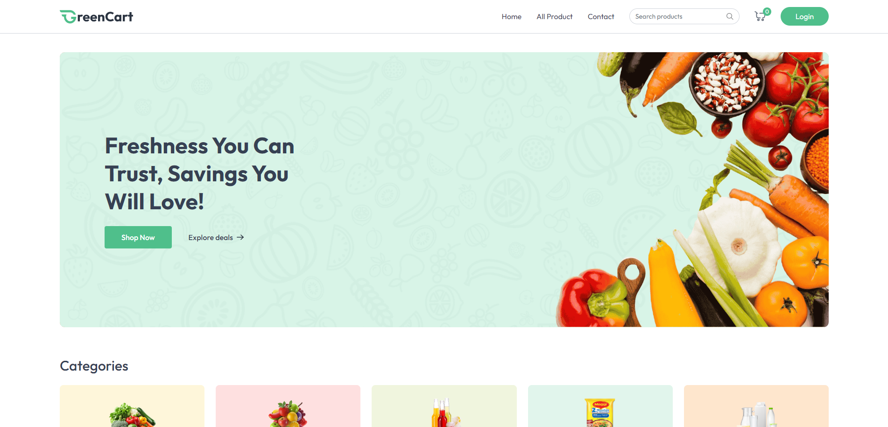
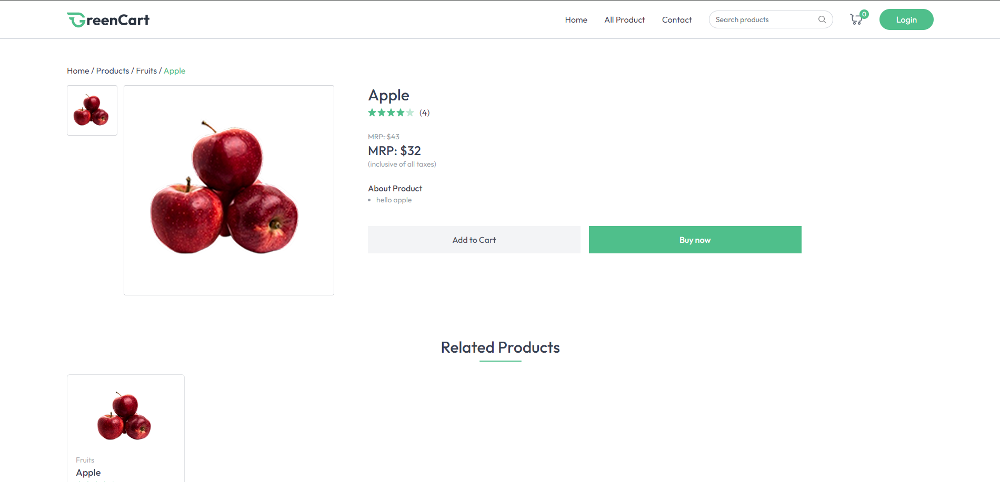
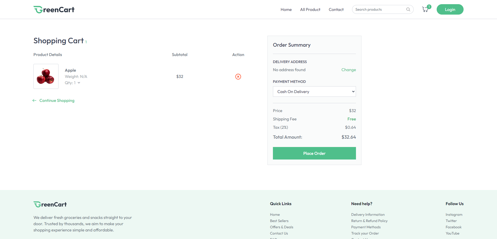
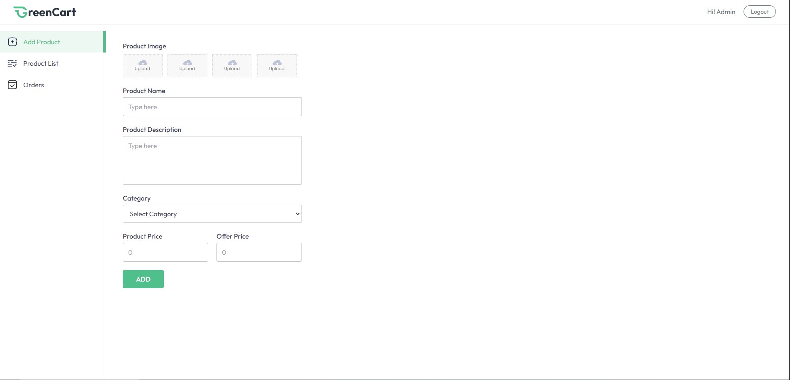
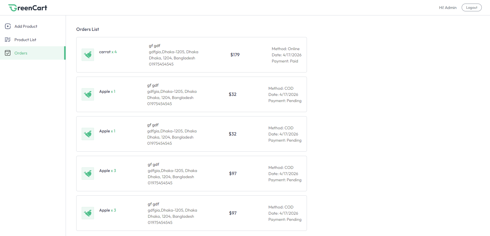

<div align="center">

# 🛒 FreshMart — E-Commerce Platform

<p>
A modern full-stack e-commerce platform for fresh products built with the MERN stack, Stripe payments, Cloudinary image storage, and seller management features.
</p>

<p>
  <a href="https://freshmart-khaki.vercel.app/">
    
  </a>

  <a href="https://github.com/NusratAdor/FreshMart">
    
  </a>

  <a href="./LICENSE">
    
  </a>
</p>

</div>

---

## 🌐 Live Demo

🔗 **https://freshmart-khaki.vercel.app/**

---

## ✨ Features

### 👤 Customer Features

- Secure JWT-based user authentication
- Browse products by category
- Product search and filtering
- Detailed product pages
- Shopping cart functionality
- Stripe payment integration
- Order management system
- Delivery address management
- Persistent login sessions

### 🏪 Seller Features

- Separate seller authentication
- Seller dashboard for product management
- Add and manage product inventory
- Upload product images with Cloudinary
- Order management for sellers

### 📱 Modern User Experience

- Fully responsive design
- Fast frontend powered by Vite
- Smooth toast notifications
- Optimized shopping workflow
- Mobile-friendly UI with Tailwind CSS

---

## 🔌 Backend & API Features

- RESTful API architecture
- JWT authentication & authorization
- Secure password hashing using bcryptjs
- Cloudinary image upload integration
- Stripe payment processing
- Modular backend structure
- Protected seller routes
- Centralized API handling

---

## 💡 Why I Built This

I built FreshMart to explore scalable MERN-stack e-commerce architecture, authentication systems, payment integration, image management, seller workflows, and production-ready backend API development.

---

## 🛠️ Tech Stack

### Frontend

| Technology | Purpose |
|---|---|
| React.js | UI framework |
| Vite | Frontend tooling |
| Tailwind CSS | Styling |
| React Router DOM | Client-side routing |
| Axios | API requests |
| React Hot Toast | Notifications |

### Backend

| Technology | Purpose |
|---|---|
| Node.js + Express.js | Backend server |
| MongoDB + Mongoose | Database & ODM |
| JWT | Authentication |
| bcryptjs | Password hashing |
| Multer | File uploads |
| Cloudinary | Cloud image storage |
| Stripe | Payment processing |

### Deployment & Infrastructure

| Technology | Purpose |
|---|---|
| Vercel | Frontend deployment |
| Render / Railway | Backend deployment |
| MongoDB Atlas | Cloud database hosting |
| Cloudinary | Media management |

---

## 📸 Screenshots

### Homepage


### Product Details


### Shopping Cart


### Seller Dashboard


### Orders Page


---

## ⚙️ Getting Started

### Prerequisites

- Node.js 18+
- MongoDB Atlas account
- Cloudinary account
- Stripe account

---

### 1. Clone the repository

```bash
git clone https://github.com/NusratAdor/FreshMart.git
cd freshmart
```

---

### 2. Install dependencies

```bash
# Install backend dependencies
cd server && npm install

# Install frontend dependencies
cd ../client && npm install
```

---

### 3. Configure environment variables

Create a `.env` file inside the `server/` directory:

```env
PORT=4000

MONGODB_URI=

JWT_SECRET=

CLOUDINARY_CLOUD_NAME=
CLOUDINARY_API_KEY=
CLOUDINARY_API_SECRET=

STRIPE_SECRET_KEY=

CLIENT_URL=http://localhost:5173

NODE_ENV=development
```

Create a `.env` file inside the `client/` directory:

```env
VITE_BACKEND_URL=http://localhost:4000
VITE_CURRENCY=$
```

---

### 4. Run development servers

```bash
# Start backend server
cd server
npm run server
```

```bash
# Start frontend server
cd client
npm run dev
```

Frontend runs at:

```txt
http://localhost:5173
```

Backend runs at:

```txt
http://localhost:4000
```

---

## 📁 Project Structure

```txt
freshmart/
├── client/                     # React frontend
│   ├── public/
│   ├── src/
│   │   ├── assets/             # Static assets
│   │   ├── components/         # Reusable UI components
│   │   ├── context/            # React Context API
│   │   ├── pages/              # Application pages
│   │   ├── App.jsx
│   │   ├── main.jsx
│   │   └── index.css
│   ├── package.json
│   └── vite.config.js
│
├── server/                     # Express backend
│   ├── configs/                # Database & cloud configs
│   ├── controllers/            # API controllers
│   ├── middlewares/            # Authentication middlewares
│   ├── models/                 # Mongoose models
│   ├── routes/                 # API route definitions
│   ├── server.js               # Backend entry point
│   └── package.json
│
├── screenshots/                # README screenshots
├── README.md
└── .gitignore
```

---

## 🏗️ Architecture Overview

```txt
React Frontend
      ↓
REST API (Express.js)
      ↓
MongoDB Database

JWT Authentication
      ↓
Protected Routes

Stripe Payments
      ↓
Order Processing

Cloudinary Uploads
      ↓
Product Image Storage
```

---

## ☁️ Deployment

- Frontend deployed on Vercel
- Backend deployed on Render or Railway
- MongoDB database hosted on MongoDB Atlas
- Product images managed via Cloudinary
- Payments powered by Stripe

---

## 🚀 Future Improvements

- [ ] Wishlist functionality
- [ ] Product reviews & ratings
- [ ] Real-time order tracking
- [ ] Admin analytics dashboard
- [ ] Coupon & discount system
- [ ] Multi-language support

---

## 👩‍💻 Author

**Nusrat Ador**  
📧 [nusratjahan141462@gmail.com](mailto:nusratjahan141462@gmail.com)  
🔗 GitHub: https://github.com/NusratAdor

---

## 🚀 Future Goals

This project is continuously evolving with improvements focused on scalable MERN architecture, advanced seller workflows, payment systems, and modern e-commerce experiences.

---

## 📜 License

This project is licensed under the MIT License.
